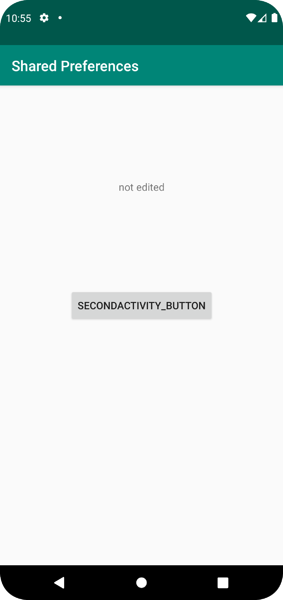
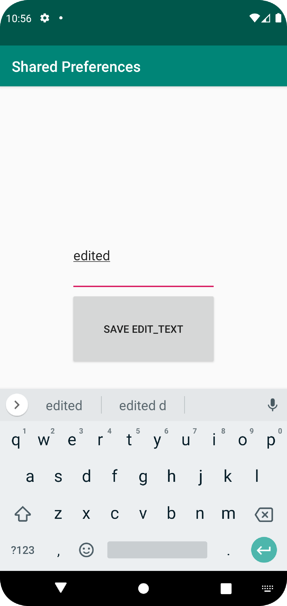
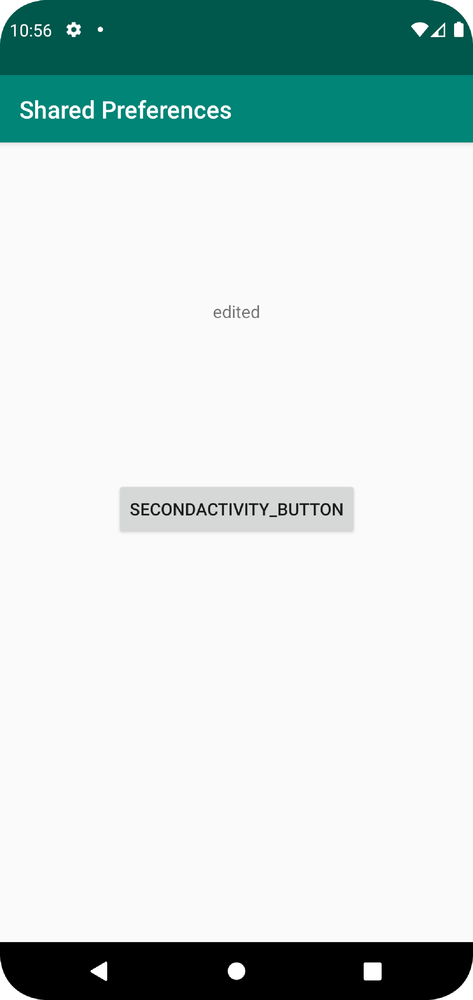

# Rapport

Importerar paket som kommer användas.

```
import android.content.Intent;
import android.content.SharedPreferences;
import android.os.Bundle;
import android.view.View;
import android.widget.Button;
import android.widget.TextView;

```

Deklarerar en TextView och en SharedPreferences.

```
    TextView textViewName;
    SharedPreferences preferences;
```

Sätter textViewName till en TextView med ID "name".

```
        textViewName = findViewById(R.id.name);
```

Sätter preferences till en SharedPreferences med namnet "preferences" i privat läge.

```
        preferences = getSharedPreferences("preferences", MODE_PRIVATE);
```

Deklarerar en Button som initieras till en Button med ID "switch_button" och sätter en OnClickListener på den som startar SecondActivity när knappen blir tryckt.

```
        Button switchActivityButton = findViewById(R.id.switch_button);
        switchActivityButton.setOnClickListener(new View.OnClickListener() {
            @Override
            public void onClick(View view) {
                Intent intent = new Intent(MainActivity.this, SecondActivity.class);
                startActivity(intent);
            }
        });
```

En Button med ID "switch_button" och en TextView med ID "name" i activity_main.xml.

```
    <Button
        android:id="@+id/switch_button"
        android:layout_width="wrap_content"
        android:layout_height="wrap_content"
        android:text="SecondActivity_button"
        app:layout_constraintBottom_toBottomOf="parent"
        app:layout_constraintLeft_toLeftOf="parent"
        app:layout_constraintRight_toRightOf="parent"
        app:layout_constraintTop_toTopOf="parent" />

    <TextView
        android:id="@+id/name"
        android:layout_width="wrap_content"
        android:layout_height="wrap_content"
        android:text="@string/app_name"
        app:layout_constraintBottom_toTopOf="@+id/switch_button"
        app:layout_constraintEnd_toEndOf="parent"
        app:layout_constraintStart_toStartOf="parent"
        app:layout_constraintTop_toBottomOf="@+id/appBarLayout" />
```

Skapade en SecondActivity klass som vid en knapptryckning sparar texten i en EditText i en SharedPreferences med namnet "name" och stänger sig själv.

```
package com.example.project;

import androidx.appcompat.app.AppCompatActivity;

import android.content.SharedPreferences;
import android.os.Bundle;
import android.view.View;
import android.widget.Button;
import android.widget.EditText;

public class SecondActivity extends AppCompatActivity {

    SharedPreferences preferences;
    SharedPreferences.Editor editor;

    @Override
    protected void onCreate(Bundle savedInstanceState) {
        super.onCreate(savedInstanceState);
        setContentView(R.layout.activity_second);

        preferences = getSharedPreferences("preferences", MODE_PRIVATE);
        editor = preferences.edit();

        Button saveButton = findViewById(R.id.saving_button);
        saveButton.setOnClickListener(new View.OnClickListener() {
            @Override
            public void onClick(View view) {
                EditText editText = findViewById(R.id.edit_text);
                String editedText = editText.getText().toString();
                editor.putString("name", editedText);
                editor.apply();
                finish();
            }
        });
    }
}
```

SecondActivity lades till i AndroidManifest.xml.

```
            android:name=".SecondActivity"
            android:exported="false" />
        <activity
```

Skapade en xml fil för SecondActivity med en EditText med ID "edit_text" och en Button med ID "saving_button".

```
<?xml version="1.0" encoding="utf-8"?>
<androidx.constraintlayout.widget.ConstraintLayout xmlns:android="http://schemas.android.com/apk/res/android"
    xmlns:app="http://schemas.android.com/apk/res-auto"
    xmlns:tools="http://schemas.android.com/tools"
    android:layout_width="match_parent"
    android:layout_height="match_parent"
    tools:context=".SecondActivity">

    <EditText
        android:id="@+id/edit_text"
        android:layout_width="200dp"
        android:layout_height="100dp"
        app:layout_constraintBottom_toTopOf="@+id/saving_button"
        app:layout_constraintEnd_toEndOf="parent"
        app:layout_constraintStart_toStartOf="parent" />

    <Button
        android:id="@+id/saving_button"
        android:layout_width="200dp"
        android:layout_height="100dp"
        android:text="Save edit_text"
        app:layout_constraintBottom_toBottomOf="parent"
        app:layout_constraintEnd_toEndOf="parent"
        app:layout_constraintStart_toStartOf="parent"
        app:layout_constraintTop_toTopOf="parent" />
</androidx.constraintlayout.widget.ConstraintLayout>
```

Skärmdump av MainActivity innan texten har blivit ändrad i SecondActivity.



Skärmdump av SecondActivity med "edited" inskrivet i en EditText.



Skärmdump av MainActivity efter texten har blivit ändrad till "edited" i SecondActivity.

